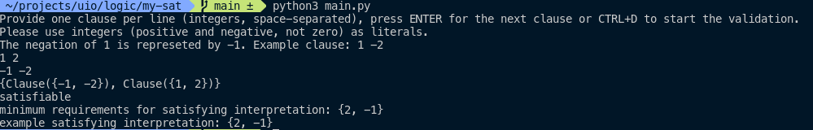

# SAT Solver for Obligatory 2

The solver checks the satisfiability of a propositional formula in clause form and provides a satisfying interpretation if applicable.

## Usage

The formula may be provided in two ways: interactively or via an input file

### With interactive input

Run `main.py` and follow the prompts on screen. You may provide an arbitrary number of clauses – one per line – with an arbitrary number of literals each. Propositional variables are represented by integers. A negative integer represents a negated literal, e.g., `-1` is the negation of `1`. Zero (`0`) is therefore **NOT** valid.

To end the clause definition and start the validation, press `Ctrl+D` to close the standard input (stdin).

Example run:

### With file input

Alternatively, the user may provide their formula in a separate file. Its path must be provided as the first (optional) command line argument when executing the script. The file may only contain a single formula. Valid examples can be found in the folder `examples`.

Example run:

